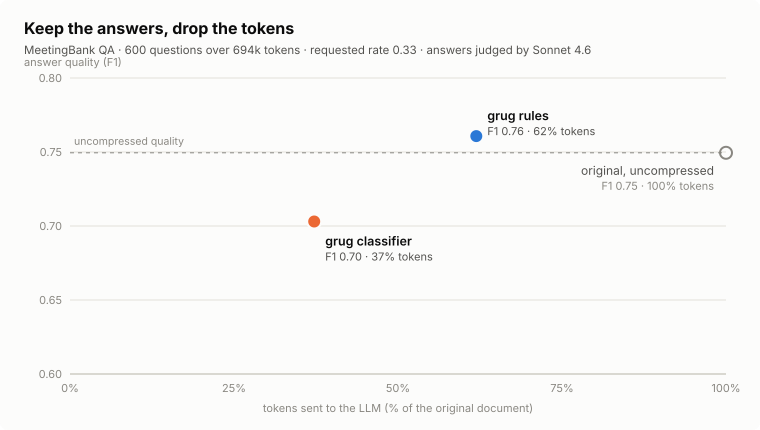
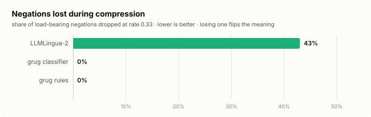

<div align="center">

# grug

**grug make text small. grug keep meaning.**

Shrink anything feed LLM. Keep words change answer.

[](https://pypi.org/project/grugify/)
[](https://github.com/akshayballal95/grug)
[](https://github.com/akshayballal95/grug/actions/workflows/ci.yml)
[](LICENSE)

</div>

---

Most text ends up context window padding. Documents stuff RAG, tool results agent loops back itself, transcripts, tickets, logs: models answer without articles, copulas, "". grug deletes padding refuses touch what carries meaning: negations, numbers, names, code, URLs, markdown structure. checks own output warns if anything load-bearing went missing anyway.

```text
Before (94 tokens)                          After `grug compress --rate 0.5` (65 tokens)

It is important to note that the billing    billing pipeline rewritten run streaming
pipeline has been rewritten to run on the   ingest service. migration not automatic:
streaming ingest service. The migration     accounts legacy monthly plan must moved
is not automatic: accounts on the legacy    hand before cutover date. practice
monthly plan must be moved by hand before   measured median lag 1.2 seconds across
the cutover date. In practice we measured   4,800 accounts, and p99 lag of 9.6
a median lag of 1.2 seconds across 4,800    seconds. key economic point easy wrong:
accounts, and a p99 lag of 9.6 seconds.     bills scale volume, not price.
The key economic point is easy to get
wrong: bills scale with volume, not price.
```

Every number made both negations. second one (`not price`) whole point paragraph. Zero warnings verifier.

## Why exists

Compressing LLM input not new. problem existing compressors score words how much information seem carry, word like "not" three characters function word looks eminently droppable. Drop compressed text asserts opposite source, fluent prose nothing downstream will question.

risk same whether text prompt, retrieved document, or output tool call agent reason over. grug built around not taking it:

- Negations, digits, code, URLs, words relating two numbers can never
dropped. `3 of 12` never comes back `3 12`. lives engine, not
setting could forget turn on.
- Every result checked afterwards lost negations, numbers, names,
warnings land `result.warnings`. CLI exit codes made CI.
- The default backend pure Python. No torch, no downloads, milliseconds per
document. `import grug` never imports torch even extras installed.
- Word lists, regex rules, phrase rewrites, whole languages data can
add remove, not code fork.

## The numbers

600 questions over 694k tokens of [MeetingBank](https://huggingface.co/datasets/microsoft/MeetingBank-LLMCompressed) transcripts, compressed rate 0.33, answered by Kimi K2.5, scored against reference answers:

<picture>
  <source media="(prefers-color-scheme: dark)" srcset="docs/assets/qa-quality-dark.svg">
  
</picture>

Compression only helps if meaning survives it. Same run, scored dropped
negations:

<picture>
  <source media="(prefers-color-scheme: dark)" srcset="docs/assets/negation-loss-dark.svg">
  
</picture>

| Backend | Tokens kept | Exact match | F1 | Negations lost |
| --- | ---: | ---: | ---: | ---: |
| original (no compression) | 100% | 0.61 | 0.76 | n/a |
| **grug rules** | 62% | **0.62** | **0.78** | **0%** |
| **grug classifier** (mmbert-small) | 37% | 0.58 | 0.71 | 2% |
| LLMLingua-2 | 30% | 0.56 | 0.70 | 43% |

Two things stand out. Compressing `grug rules` scored *better* sending full document, sounds wrong until remember what deletes noise. classifier reaches third tokens same answer quality LLMLingua-2 while losing 2% negations instead 43%.

Reproduce `grug benchmark qa`. Raw results
[`benchmarks/`](benchmarks/kimi-k2.5-full/).

## Quick start

```bash
pip install grugify
```

```python
import grug

result = grug.compress(document, rate=0.5)
result.text      # the compressed document
result.ratio     # what was achieved, not what was asked for
result.warnings  # faithfulness report; [] means nothing suspicious
```

Or shell:

```bash
grug compress notes.md                  # writes notes.grug.md, stats to stderr
grug compress - < in.txt > out.txt      # stdin to stdout
grug verify original.txt compressed.txt # faithfulness checks on their own
```

If want deeper compression rule lists can reach, install trained classifier `pip install 'grugify[classifier]'`:

```python
result = grug.compress(
    document,
    rate=0.33,
    backend="classifier",
    backend_kwargs={"model_name": "akshayballal/grug-mmbert-small-meetingbank"},
)
```

## Two backends

| Backend | Install | Method | Rates it reaches | Speed |
| --- | --- | --- | --- | --- |
| `rules` | included | Deletes words its rule set nominates; the engine vetoes everything load-bearing | floors out around 0.6, when it runs out of safe words to drop | milliseconds |
| `classifier` | `grugify[classifier]` | A fine-tuned encoder scores every word and the top-`rate` fraction survives, in order | 0.2 to 0.5 | about 0.2s per 400-token chunk on CPU, after a one-off model load |

Both extractive: output subsequence input, neither can invent fact. `rate` means same thing everywhere, fraction tokens *keep*. backend cannot hit exactly reports what achieved `result.ratio`.

classifier takes Hugging Face token-classification checkpoint trained preserve/discard head fast tokenizer (ModernBERT, mmBERT, EuroBERT all work). Training own three commands; see [TRAINING.md](TRAINING.md).

## The rules engine

default backend splits responsibility two. Rules nominate words drop. engine decides, vetoes always win. token budget derived `rate` controls how deep cutting goes. Everything rules side composable:

```python
from grug.backends.rules import ENGLISH, PatternRule, RulesBackend, WordClassRule

rules = (
    ENGLISH.rules
    .remove("pronouns")                                   # subtract a word class
    .add(WordClassRule("corp-speak", {"synergy", "leverage"}, priority=5))
    .add(PatternRule("hedges", r"(arguabl|probabl|possibl)\w*", priority=15))
)

backend = RulesBackend(
    rules=rules,
    keep_words={"pipeline"},        # exact vetoes
    keep_patterns=(r"[A-Z]{2,}",),  # regex vetoes, e.g. keep acronyms like "IT"
)
```

new language data pack, not fork:

```python
from grug.backends.rules import Language, RuleSet, WordClassRule, register_language

register_language(Language(
    code="de",
    rules=RuleSet(WordClassRule("artikel", {"der", "die", "das"}, priority=10)),
    never_drop=frozenset({"nicht", "kein", "keine", "ohne"}),
))
backend = RulesBackend(language="de")
```

Because vetoes belong engine, badly written custom rule cannot break guarantees. test hostile rule nominates every single word document, negations, numbers, code spans still come through. [`examples/rules_backend.py`](examples/rules_backend.py) walks all it.

## Faithfulness

```python
>>> grug.verify("bills scale with volume, not price", "bills scale volume price")
["negation lost: 'not' (1× → 0×) — meaning may be inverted"]
```

Prevention first: rules engine will not drop negations, digits, or connectives numbers rate, classifier pins negations, digits, detected entities, markdown structure before ranks anything.

Verification second: every compression checked negation loss, negation scope loss, number loss, entity loss. no NER model no ML verifier, regex exact matching. costs precision entities buys checker works exactly terse, ungrammatical text model-based checker would choke microseconds.

clean run means nothing suspicious found, not compression provably faithful. Treat like smoke alarm.

### CI gating

| Code | Meaning |
| --- | --- |
| `0` | Compressed, no faithfulness warnings |
| `1` | Error: bad file, unknown backend, missing dependency |
| `2` | Compressed, but the verifier flagged something |

Exit code 2 means human should read diff", not failed".

## Markdown awareness

Documents parsed real CommonMark parser ([markdown-it-py](https://github.com/executablebooks/markdown-it-py)) rather pattern-matched, structure survives:

| Element | Treatment |
| --- | --- |
| Fenced / indented code, tables | Bypass the compressor, re-emitted byte for byte |
| Whole source files | Passed through unchanged (`--compress-code` overrides) |
| Headings, bullets, blockquote markers | Marker preserved, the text after it compresses |
| Inline code spans and URLs | Swapped for opaque placeholders, restored verbatim |
| Numbers and identifiers with separators (`1,250`, `us-east-1`, `v2.1.0-rc3`) | Protected as spans |
| Blank lines | Hard chunk boundaries, so no backend can collapse a paragraph break |

Long documents chunked roughly 450 tokens sentence boundaries rejoined original layout.

## CLI reference

```bash
grug compress docs/*.md --rate 0.4        # many files, each to <name>.grug.md
grug compress notes.md --json -q          # full CompressionResult as JSON
grug backends                             # what is registered and installed
grug train --help                         # reproduce the classifier (TRAINING.md)
grug benchmark qa --help                  # reproduce the numbers above
```

| Flag | Effect |
| --- | --- |
| `--rate`, `-r` | Fraction of tokens to keep. Default `0.5`. |
| `--backend`, `-b` | Backend name. Default `rules`. |
| `--model` | Checkpoint for `--backend classifier`. |
| `--device` | `cpu`, `cuda`, `mps`, or `auto`. |
| `--no-verify` | Skip the faithfulness checks. |
| `--json` | Emit the full result as JSON on stdout. |
| `--quiet`, `-q` | Suppress the stats line. |

## Write own backend

Subclass one ABC register it. shows up `grug.compress()`, `grug.Compressor`, CLI without changes grug:

```python
from grug.base import CompressionResult, CompressorBackend


class ShoutyBackend(CompressorBackend):
    name = "shouty"
    description = "Keeps only the long words."

    def compress(self, text: str, rate: float = 0.5, **kwargs) -> CompressionResult:
        self._validate_rate(rate)
        cutoff = 3 + int((1 - rate) * 5)
        kept = " ".join(w for w in text.split() if len(w) > cutoff)
        return CompressionResult.build(text, kept, self.name)
```

ship package, advertise entry point `pip install` all user needs:

```toml
[project.entry-points."grug.backends"]
shouty = "my_package.backend:ShoutyBackend"
```

## Contributing

```bash
git clone https://github.com/akshayballal95/grug && cd grug
uv sync --all-extras          # or: pip install -e '.[dev,tokens]'
uv run pytest -m "not slow"   # fast suite, no model downloads
uv run ruff check src tests examples scripts
```

codebase small purpose: two backends, one verifier, one chunker. If looking somewhere start, language pack rules engine, benchmark own data, or trained checkpoint new encoder would all welcome PRs.

## License

[MIT](LICENSE). The bundled benchmark uses the
[MeetingBank-LLMCompressed](https://huggingface.co/datasets/microsoft/MeetingBank-LLMCompressed)
dataset; check license before shipping checkpoint trained it.

---

<div align="center">

*grug not need many words. grug need right words.*

README, [compressed grug itself](README.grug.md).

</div>
